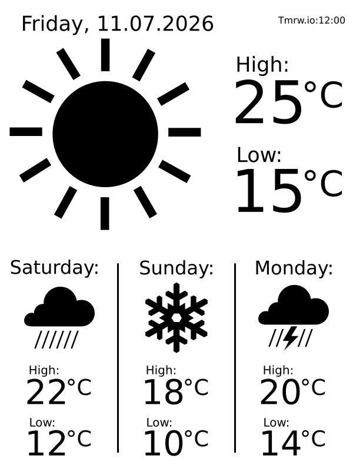

# Kindle Weather Display
Turn a Kindle into a weather display.

## Setup
Install the content of the "server" folder on a server and the content of the "kindle" folder to the kindle.

### Server Setup
1. Fill me out

### Kindle Setup

See [kindle/README.md](kindle/README.md) for full installation instructions, file placement, and configuration.

### Lambda Setup

The Lambda function requires the following **environment variables** to be configured in the AWS Lambda console (Configuration → Environment variables):

| Variable | Description |
|---|---|
| `TOMORROW_API_KEY` | API key for the tomorrow.io weather service |
| `S3BucketName` | Name of the S3 bucket where the output image is stored |
| `S3FileName` | Key (filename) of the output image in the S3 bucket |
| `LATITUDE` | Latitude of the location to display weather for |
| `LONGITUDE` | Longitude of the location to display weather for |
| `FONTCONFIG_PATH` | Must be set to `/opt/fonts` so that `rsvg-convert` can find the DejaVu Sans fonts bundled in the `librsvg_lambda_layer` |

#### Lambda Layers

The function requires the following Lambda layers, built from `Lambda/layers/`:

| Layer | Purpose |
|---|---|
| `requests_314_layer` | HTTP library |
| `pytz_314_layer` | Timezone data |
| `Pillow_314_layer` | Image processing |
| `librsvg_lambda_layer` | `rsvg-convert` binary + DejaVu Sans fonts |

Build all layers by running:

```bash
cd Lambda/layers
./build_all_layers.sh
```

Then publish each zip to AWS and attach the resulting layer ARNs to the function.

## Preview



### Attribution
This is based on work from:

* [Kindle Weather Display][1] by [Matthew Petroff][2]
* [AvaKindle][3] by [Anselm Köhler][4]

[1]: http://www.mpetroff.net/archives/2012/09/14/kindle-weather-display/
[2]: https://mpetroff.net/
[3]: https://github.com/snowtechblog/avakindle
[4]: https://www.linkedin.com/in/anselm-k%C3%B6hler-b94232101
